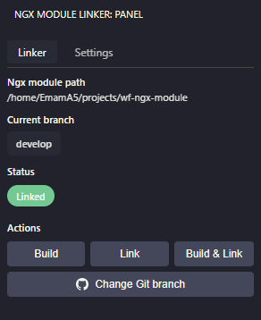
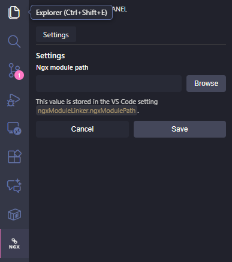
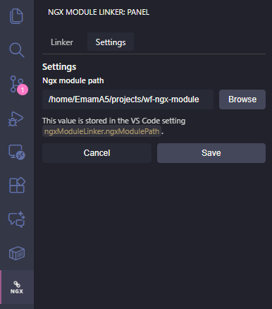
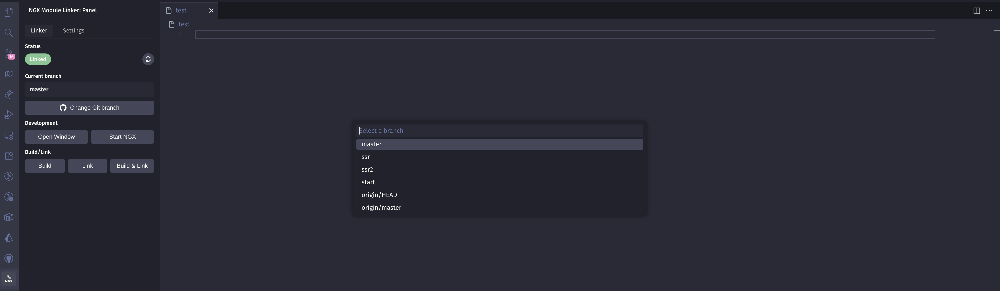

# Ngx Module Linker (Internal)

Your helper inside VS Code for working with the shared `ngx-module` library in your WebFactory DE Angular apps.

---

## What this extension does

Ngx Module Linker makes it easy to work with a central `ngx-module` library while developing multiple WebFactory DE Angular apps.

- **Remembers your shared `ngx-module` location** so you set it once and reuse it.
- **Shows the current ngx-module Git branch and link status in the status bar** (e.g. `NGX: develop [Linked]` or `NGX: develop [Not Linked]`).
- **Provides a dedicated "Ngx Module Linker" sidebar panel** where you can see:
  - the configured `ngx-module` path
  - the current Git branch
  - whether your app is *Linked* or *Not Linked*
- **Lets you switch ngx-module branches from a quick pick** (no need to open a terminal).
- **Builds the ngx-module library for you**.
- **Builds and links ngx-module into the current WebFactory DE Angular app** so you can immediately use the latest changes.

This is designed for teams who share a single `ngx-module` library across several WebFactory DE Angular applications.

---

## Quick visual tour

> Replace the image paths below with your real screenshots or GIFs.

1. **Overview – status bar and commands**  
   

2. **Configure shared ngx-module folder**  
   

   

3. **Switch ngx-module branch**  
   

---

## Getting started

### 1. Install and open a compatible WebFactory DE Angular app

1. Install the **Ngx Module Linker** extension in VS Code.
2. Open a WebFactory DE Angular project that is allowed to use the shared `ngx-module` library (as configured by your team).

> Tip: If the extension is active for the project, you will see an item for `ngx-module` in the VS Code status bar.

### 2. Tell the extension where your shared `ngx-module` lives

You only need to do this once per machine.

1. Open the **Command Palette** in VS Code (`Ctrl+Shift+P` or `Cmd+Shift+P`).
2. Run: `Ngx Module: Configure ngx-module Path`.
3. In the folder picker, select the **root folder of the shared `ngx-module` project** (the repo containing the library code).

From now on, the extension will remember this directory and reuse it across sessions.

### 3. Build and link ngx-module into your current WebFactory DE Angular app

When you’re inside a supported WebFactory DE Angular app:

1. Either open the **Ngx Module Linker** sidebar (icon in the Activity Bar) and click **Build & Link**,
   or open the **Command Palette** and run `Ngx Module: Build and Link`.
2. Wait for the build and linking to finish.
3. Start or refresh your WebFactory DE Angular app – it will now use the shared `ngx-module` from the directory you configured.

If you only want to build the library without linking it:

1. Open the **Command Palette**.
2. Run: `Ngx Module: Build Library`.

### 4. Check and change the ngx-module branch

You can see which `ngx-module` branch you are on directly in the VS Code status bar.

To change it:

1. Open the **Command Palette**.
2. Run: `Ngx Module: Switch Branch`.
3. Pick the branch you want from the list.

The status bar will update to reflect the new branch.

You will also see the updated branch and link status in the **Ngx Module Linker** sidebar.

---

## How it works behind the scenes (non-technical)

- The extension keeps track of a **single shared installation** of your `ngx-module` library on your machine.
- When you hit **Build** or **Build & Link**, it:
  - builds that shared library, and
  - connects your current WebFactory DE Angular app to it, so they use the **same codebase**.
- The **status bar** and the **sidebar panel** constantly check whether your app is actually using that shared library and show you:
  - which Git branch of `ngx-module` is active, and
  - whether the app is currently *Linked* to it or not.

You don’t need to know the underlying commands or file system details – the extension handles that for you and just shows you clear status labels and buttons.

---

## For developers of this extension (optional)

If you work on the extension itself:

1. Run `npm install`.
2. Press `F5` in VS Code to start a new Extension Host with this extension loaded.
3. In a supported Angular project, open the Command Palette and try:
   - `Ngx Module: Configure ngx-module Path`
   - `Ngx Module: Switch Branch`
   - `Ngx Module: Build Library`
   - `Ngx Module: Build and Link`
