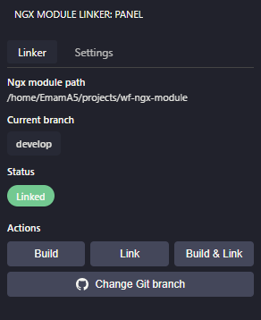
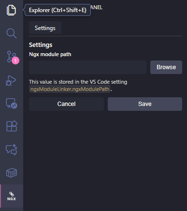
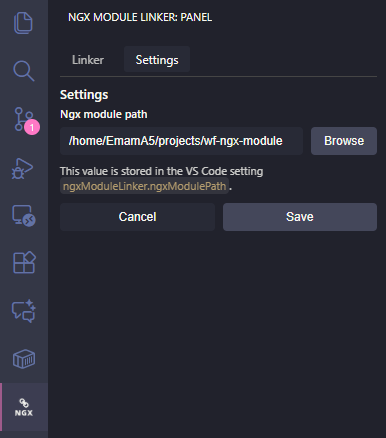
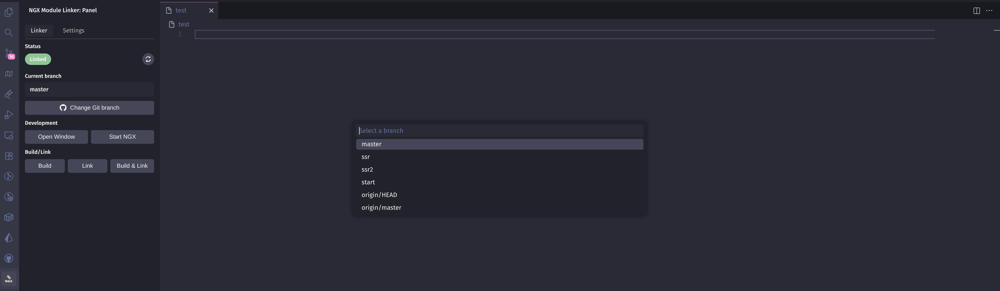

# Ngx Module Linker (Internal)

Your helper inside VS Code for working with the shared `ngx-module` library (`@vfde-care/ngx-lib`) in your WebFactory DE Angular apps.

---

## 📖 Overview

Ngx Module Linker makes it easy to work with a central `ngx-module` library while developing multiple WebFactory DE Angular apps concurrently.

- **Persistent Configuration**: Remembers your shared `ngx-module` location so you set it up once and reuse it across all projects.
- **Status Bar Integration**: Shows the current `ngx-module` Git branch and link status in the status bar (e.g. `NGX: develop [Linked]` or `NGX: develop [Not Linked]`).
- **Dedicated Sidebar Panel**: Provides a "Ngx Module Linker" view where you can see:
  - The configured `ngx-module` path
  - The current Git branch
  - The real-time Link status
- **Seamless Branch Switching**: Switch `ngx-module` branches directly from a quick pick menu (no terminal needed).
- **Complete Workflow Automation**: Easily install dependencies, start, build, and link the `ngx-module` into your current WebFactory DE Angular app with a single click.
- **Quick Access**: Open the `ngx-module` workspace in a separate VS Code window instantly.

This extension is specifically designed for teams who share a single `ngx-module` library across several WebFactory DE Angular applications.

---

## 🚀 Getting Started

### 1. Requirements

1. Install the **Ngx Module Linker** extension in VS Code.
2. Open a WebFactory DE Angular project that is configured to use the shared `ngx-module` library.

> **Tip:** If the extension determines the current project is eligible, you will see an `NGX:` item right in your VS Code status bar.

### 2. Configure the Shared `ngx-module` Path

You only need to do this once per machine.

1. Open the **Command Palette** in VS Code (`Ctrl+Shift+P` or `Cmd+Shift+P`).
2. Run command: **`NGX Module Linker: Configure NGX module Path`**.
3. In the folder picker, select the **root folder of the shared `ngx-module` project** (the directory containing its `package.json` and the `distribution/ngx-lib` folder).

*This path is saved globally in your VS Code settings under `ngxModuleLinker.ngxModulePath`.*

---

## 🛠 Commands & Features

The extension provides a rich set of commands, accessible via the **Ngx Module Linker** Activity Bar panel or the standard VS Code Command Palette.

### 🔌 Linking & Building
- **Build and Link** (`ngxModuleLinker.buildAndLink`): The most common action. Builds the library (`npm run build:lib`) and links the distribution folder to your current Angular application using `npm link`. Options for using `--legacy-peer-deps` are available from the UI split-button.
- **Build Library** (`ngxModuleLinker.buildLib`): Only builds the `ngx-module` library without linking it.
- **Link** (`ngxModuleLinker.link`): Links the already-built `ngx-module` distribution to the current app without rebuilding. Options for using `--legacy-peer-deps` are available from the UI split-button.

### 🌿 Git Management
- **Switch Branch** (`ngxModuleLinker.switchBranch`): Fetches the latest branches from the `ngx-module` repository and lets you check out a different branch directly via a VS Code Quick Pick.

### 📦 Dependency & Process Management
- **Install NGX** (`ngxModuleLinker.npmInstall`): Runs `npm run setup` inside the `ngx-module` folder. If triggered as a clean install (available in the UI split-button), it will prompt for confirmation, then remove `node_modules` and `package-lock.json` before running the setup.
- **Start NGX** (`ngxModuleLinker.npmStart`): Runs `npm start` in the `ngx-module` project.

### 🧭 Navigation
- **Open NGX Module in New Window** (`ngxModuleLinker.openNgxWindow`): Instantly opens your configured `ngx-module` path in a new, separate VS Code application window for deep-dive editing.
- **Open Panel** (`ngxModuleLinker.focusView`): Focuses the Ngx Module Linker Activity Bar sidebar.

---

## 📸 Quick Visual Tour

1. **Overview – Status Bar and Commands**  
   

2. **Configure Shared ngx-module Folder**  
     
   

3. **Switch ngx-module Branch**  
   

---

## 🧠 How It Works Behind the Scenes

- The extension tracks a **single shared installation** of your `ngx-module` library on your machine.
- When you execute **Build & Link**, it sequentially:
  1. Compiles the shared library.
  2. Runs `npm link` inside the newly built `ngx-module` distribution directory.
  3. Runs `npm link @vfde-care/ngx-lib` inside your current App workspace, effectively symlinking the library for immediate local testing.
- The **Status Bar** and **Sidebar Panel** actively monitor your workspace to determine if your app's `node_modules/@vfde-care/ngx-lib` is a symlink pointing to your configured path, keeping your "Link Status" accurate and up to date.

You don’t need to memorize paths, CLI flags, or specific commands. The extension handles terminal automation for you!
